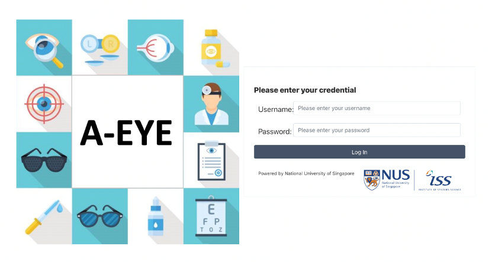
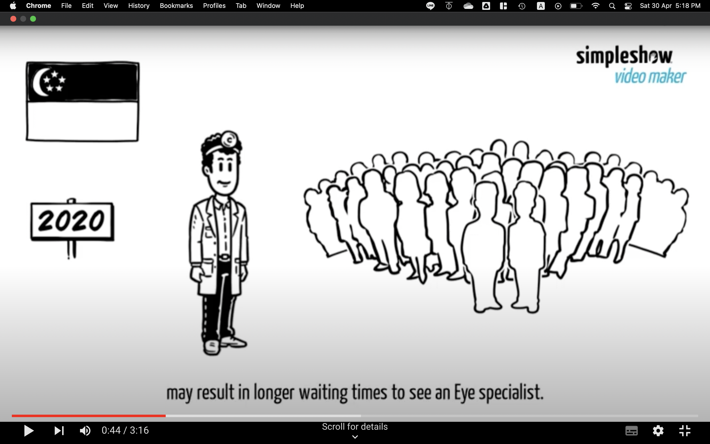
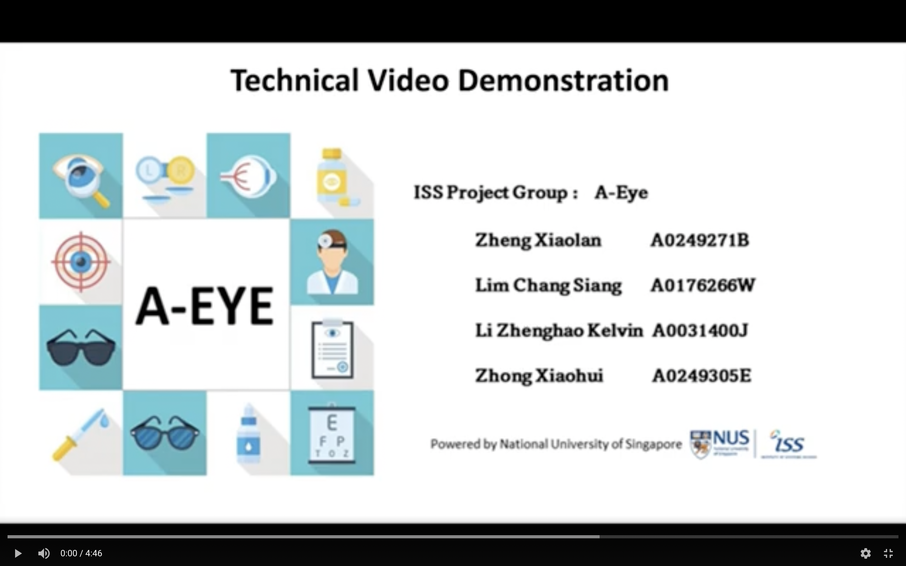

# IRS-PM-2022-05-01-IS04PT-GRP6-AEYE-Diagnosis-System
## SECTION 1 : PROJECT TITLE
## An Eye diagnosis and triaging system (A-EYE)

---

## SECTION 2 : EXECUTIVE SUMMARY / PAPER ABSTRACT
An important tenet of healthcare is in obtaining the correct diagnosis for a patient. However, medical care is complex and involves multiple levels of care, administered by different specialties. Our group project addresses the need for primary care physicians to be able to diagnosis and triage eye conditions accurately. To this end, we designed a machine reasoning system to process the patient’s symptoms to reach a diagnosis or a list of differential diagnoses. To supplement the doctor’s capabilities, we have also added a feature to identify abnormal pupillary response, which can be indicative of a more serious eye condition. 

---

## SECTION 3 : CREDITS / PROJECT CONTRIBUTION

| Official Full Name  | Student ID (MTech Applicable)  | Work Items (Who Did What) | Email (Optional) |
| :------------ |:---------------:| :-----| :-----|
| Zheng Xiaolan | A0249271B | Team Lead Gather requirement Implement KIE inference system| zhengxiaolan5@gmail.com |
| Lim Chang Siang | A0176266W | Software developer Image processing and analysis Architecture design Provide technical guidance| e0231993@u.nus.edu |
| Zhong Xiaohui | A0249305E | Develop business case UI Design Report writing Video production and editing Product manager| e0938910@u.nus.edu |
| Li Zhenghao Kelvin| A0031400J | Domain expert Data collection Knowledge modelling Literature review Participant recruitment| kalphine@gmail.com |

---

## SECTION 4 : VIDEO OF SYSTEM MODELLING & USE CASE DEMO

### Business Case Presentation

### Technical Presentation

---

## SECTION 5 : USER GUIDE

`Refer to appendix <Installation & User Guide> in project report at Github Folder: ProjectReport`

### [ 1 ] System Pre-requisites
#### A Mac OS X or Linux operating system
#### Google Chrome (latest version)
#### An Android device and back-facing camera with flashlight

### [ 2 ] Software requirements
#### Java JDK 1.8
#### Android Studio v4.0 or above

#### Java JDK can be download at: https://www.oracle.com/java/technologies/downloads/
#### Android Studio can be download at: https://developer.android.com/studio

#### Deploy the A-EYE diagnosis system locally

> Unzip the file jbpm-server-7.67.0.Final-dist.zip to local directory

> Execute the bash script “standalone.sh”

> bash ./jbpm-server-7.67.0.Final-dist/bin/standalone.sh

> Open Google Chrome

> Navigate to http://localhost:8080 to see the A-EYE Login Page

#### Deploy A-EYE Android Application to Android Device
> Unzip the file Aeye_android.zip

> Connect Android device to your computer

> Run Android Studio

> On the “Welcome to Android Studio” screen, click “Open”

> Select Aeye_android folder, click “Open”

> Click “File” and select “Sync Project with Gradle File”

> Click on “Run” and select “Run App”

> Android Studio will deploy the application to your Android device

> On your Android device, tap on the “Aeye” App

---
## SECTION 6 : PROJECT REPORT / PAPER

`Refer to project report at Github Folder: ProjectReport`
- Executive Summary
- Problem description
- Problem Objective
- Knowledge Modelling
- Solution
- System Feature
- Feedback and future plans
- Limitation
- Improvement
- Conclusion
- References
- Appendix of report: Project Proposal
- Appendix of report: Mapped System Functionalities against knowledge, techniques and skills of modular courses
- Appendix of report: Installation and User Guide
- Appendix of report: Individual project report by project members
- Appendix of report: Flow Graphs

---
## SECTION 7 : MISCELLANEOUS
`Refer to Github Folder: Miscellaneous`

### A-EYE Project Schedule.xlsx
* Project planning and schedule

### A-EYE UI design Draft.xlsx
* UI design

---
### <<<<<<<<<<<<<<<<<<<< End of Template >>>>>>>>>>>>>>>>>>>>

---
